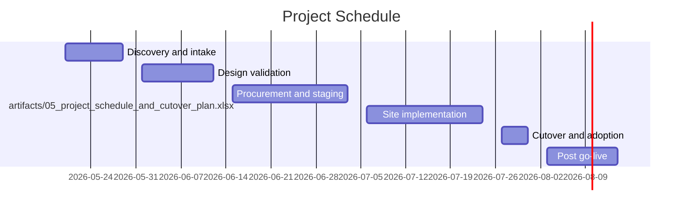

# OrbitBrief PM / Solution Architect Handoff — 2dbc02c9-9d49-40ad-8048-aae78836b0eb

**Status:** 🔴 **Not SOW-ready: 9 blocker question(s) remain**

> 2dbc02c9-9d49-40ad-8048-aae78836b0eb: Wireless / WLAN, Structured cabling, Security camera / VMS, Security access control at atl 047 04, atl 2026 047; 9 blocker and 21 warning SOW question(s) need PM/SA review.

## Executive summary

**2dbc02c9-9d49-40ad-8048-aae78836b0eb**: deal worth $1,847,250 across 19 confirmed site(s) covering Wireless / WLAN, Structured cabling, Security camera / VMS.

Status is **RED**: 9 blocker(s) and 21 warning(s) need PM resolution before SOW lock.

**Next action:** Resolve the blocker checklist below and confirm the customer clarifications email starter. Do not publish a SOW until blockers clear.

## Intake completeness

**Coverage: 10/10 (100%)**  `████████████████████`

- ✅ Confirmed contract value
- ✅ At least one confirmed physical site
- ✅ Project schedule with start + end dates
- ✅ Named executive sponsor (stakeholder)
- ✅ Hardware BOM or vendor quote
- ✅ Risk register
- ✅ Acceptance criteria definition
- ✅ Payment terms and pricing model
- ✅ Out-of-scope / exclusions list
- ✅ Compliance / MSA / NDA reference

This report translates the intake package into evidence, SOW gaps, customer questions, and SA review work.

## PM scorecard

| Metric | Value |
|---|---:|
| Source files read | 9 |
| Evidence items extracted | 295 |
| PM-visible evidence cards | 71 |
| Confirmed physical sites | 19 |
| SOW blocker questions | 9 |
| SOW warning questions | 21 |
| Top workstream | Security camera / VMS |

## Margin & profitability

| Line | Value |
|---|---:|
| Deal total (largest money ≥ $100k) | $1,847,250 |
| Hardware cost (BOM qty × unit) | $1,015,626 |
| Services subtotal (text-matched) | $536,030 |
| Logistics / freight / contingency / tax | $295,594 |
| **Total cost** | **$1,847,250** |
| Confidence | high |

- ⚠ Zero-margin SOW: deal total exactly matches computed cost. PM should add margin or confirm this is intentional (pass-through pricing).

## Engagement model

**Detected model:** Mixed (multiple models detected)

- T&M evidence in `artifacts/09_commercial_pricing_acceptance_assumptions_final.pdf`: "T&M not-to-exceed without signed CO: $250,000 cumulative"
- T&M evidence in `artifacts/09_commercial_pricing_acceptance_assumptions_final.pdf`: "Contract type: Fixed Price Agreement. Grand Total (not-to-exceed for defined scope): USD $1,847,250.00. Currency: United"
- Fixed-fee evidence in `artifacts/09_commercial_pricing_acceptance_assumptions_final.pdf`: "Contract type: Fixed Price Agreement. Grand Total (not-to-exceed for defined scope): USD $1,847,250.00. Currency: United"

## Detected workstreams

| Workstream | Routed? | SOW checks active? | Blockers | Warnings |
|---|:-:|:-:|---:|---:|
| Wireless / WLAN | ✓ | ✓ | 3 | 5 |
| Structured cabling | ✓ | ✓ | 2 | 9 |
| Security camera / VMS | ✓ | ✓ | 2 | 2 |
| Security access control | ✓ | ✓ | 1 | 3 |
| Sites / facilities |  | ✓ | 1 | 2 |
| Commercial terms |  | ✓ | 0 | 0 |
| Delivery / execution planning | ✓ | ✓ | 0 | 0 |
| Electrical / power | ✓ | ✓ | 0 | 0 |
| Hardware / equipment |  | ✓ | 0 | 0 |
| Procurement / finance | ✓ | ✓ | 0 | 0 |

## Confirmed sites

| Site | Kind | Confirmed | Evidence items | Source files |
|---|---|:-:|---:|---:|
| atl 047 04 | physical_site | ✓ | 3 | 1 |
| atl 2026 047 | physical_site | ✓ | 9 | 5 |
| atl air 03 | physical_site | ✓ | 6 | 2 |
| atl air asset type warehouse | physical_site | ✓ | 7 | 5 |
| atl cp 05 | physical_site | ✓ | 12 | 2 |
| atl hq 01 | physical_site | ✓ | 6 | 3 |
| atl hq asset type room | physical_site | ✓ | 6 | 4 |
| college pa | physical_site | ✓ | 6 | 4 |
| dev atl 047 | physical_site | ✓ | 4 | 4 |
| hs deal | physical_site | ✓ | 9 | 5 |
| mdf 3a | physical_site | ✓ | 3 | 1 |
| mon fri | physical_site | ✓ | 12 | 1 |
| mon sat | physical_site | ✓ | 3 | 1 |
| optbot college | physical_site | ✓ | 3 | 1 |
| optbot facil | physical_site | ✓ | 16 | 2 |
| optbot logis | physical_site | ✓ | 7 | 2 |
| optbot secur | physical_site | ✓ | 8 | 3 |
| optbot west campus | physical_site | ✓ | 3 | 1 |
| po mock | physical_site | ✓ | 7 | 4 |

## Stakeholder contact directory

| Name | Role | Email | Phone | Source |
|---|---|---|---|---|
| Camila Brooks | Security Architecture Lead | camila.brooks@optbot.example | — | `artifacts/01_deal_overview_executive_brief.pdf` |
| Elliot Tran | Senior Procurement Manager | elliot.tran@optbot.example | — | `artifacts/01_deal_overview_executive_brief.pdf` |
| Jordan Ames | VP Workplace Operations | jordan.ames@optbot.example | — | `artifacts/01_deal_overview_executive_brief.pdf` |
| Mock Vendor | — | renee.watkins@purtera.example | — | `artifacts/01_deal_overview_executive_brief.pdf` |
| Noah Patel | Regional Facilities Manager | noah.patel@optbot.example | — | `artifacts/01_deal_overview_executive_brief.pdf` |
| Priya Narang | Director of Enterprise IT | priya.narang@optbot.example | — | `artifacts/01_deal_overview_executive_brief.pdf` |
| Renee Watkins | Mock Vendor PM | renee.watkins@purtera.example | — | `artifacts/01_deal_overview_executive_brief.pdf` |

## Per-site evidence rollup

Aggregated by site across every document. The PM should sanity-check that each site has the device, money, date, and stakeholder coverage the SOW will need.

| Site | Atoms | Devices | Money | Dates | Stakeholders |
|---|---:|---|---|---|---|
| **AP-9700** | 2 | wi fi 7 ceiling access point |  |  |  |
| **ATL-047** | 6 |  | $1,847,250 | 2026-05-20, 2026-07-31, 2026-08-14 |  |
| **ATL-047-04** | 3 |  |  |  |  |
| **ATL-2026-047** | 9 | storage | $1,847,250 | 2026-07-31 |  |
| **ATL-AIR** | 17 | access point, display, ip camera, microphone, printer, speaker _(+4)_ | $18,500, $6,125, $2,895, $1,325, $995, $845 _(+4)_ | 2026-05-20, 2026-07-31, 2026-08-14 | Camila Brooks, Elliot Tran, Jordan Ames, Morgan Lee, Noah Patel, Priya Narang _(+1)_ |
| **ATL-AIR-03** | 6 |  |  | 2026-11-26, 2026-11-28, 2026-12-24, 2027-01-02 |  |
| **ATL-AIR-2026** | 2 |  |  |  | Noah Patel |
| **Atl Air Asset Type Warehouse** | 7 | access point, display, ip camera, microphone, speaker, switch _(+2)_ | $18,500, $6,125, $2,895, $1,325, $995, $749 _(+2)_ |  | Noah Patel, Renee Watkins |
| **ATL-CP-05** | 12 | access point, switch |  | 2026-11-26, 2026-11-28, 2026-12-24, 2027-01-02 |  |
| **ATL-HQ** | 15 | access point, display, ip camera, microphone, speaker, switch _(+2)_ | $18,500, $6,125, $2,895, $1,325, $995, $749 _(+2)_ | 2026-05-20, 2026-07-31, 2026-08-14 | Noah Patel, Renee Watkins |
| **ATL-HQ-01** | 5 |  |  |  |  |
| **ATL-HQ-2026** | 2 |  |  |  | Noah Patel |
| **Atl Hq Asset Type Room** | 6 | access point, display, ip camera, microphone, speaker, switch _(+2)_ | $18,500, $6,125, $2,895, $1,325, $995, $749 _(+2)_ |  | Noah Patel |
| **ATL-WEST** | 16 | access point, display, ip camera, microphone, speaker, switch _(+2)_ | $1,500,000, $18,500, $6,125, $2,895, $1,325, $995 _(+3)_ | 2026-05-20, 2026-07-31, 2026-08-14 | Camila Brooks, Elliot Tran, Jordan Ames, Morgan Lee, Noah Patel, Priya Narang _(+1)_ |
| **ATL-WEST-0** | 3 |  |  |  |  |
| **ATL-WEST-02** | 2 |  |  |  |  |
| **ATL-WEST-2026** | 2 |  |  |  | Noah Patel |
| **College Pa** | 2 |  |  |  |  |
| **College Park** | 2 |  |  |  |  |
| **DEV-2026-05-19** | 1 | card reader, tablet |  | 2026-05-19 |  |
| **DEV-ATL-047** | 4 |  | $1,847,250 | 2026-07-31 |  |
| **HS-DEAL** | 9 | storage | $1,847,250 | 2026-07-31 |  |
| **IC-001** | 1 |  |  | 2026-05-20 |  |
| **IC-002** | 1 | storage |  | 2026-05-21 |  |
| **IC-003** | 1 |  |  | 2026-05-26 |  |
| **IC-004** | 1 |  |  | 2026-05-29 |  |
| **MDF-3A** | 3 |  |  |  |  |
| **MDF-A** | 3 |  |  |  |  |
| **MDF-B** | 3 |  |  |  |  |
| **MDF-CP** | 3 |  |  |  |  |
| **MDF-W1** | 3 |  |  |  |  |
| **MOCK-MSA-2026** | 2 |  | $1,847,250 | 2026-07-31 |  |
| **MON-FRI** | 12 |  |  |  |  |
| **MON-SAT** | 3 |  |  |  |  |
| **Optbot College** | 3 |  |  |  |  |
| **Optbot College Park** | 3 |  |  |  |  |
| **Optbot Facil** | 16 |  |  |  | Camila Brooks, Elliot Tran, Jordan Ames, Mock Vendor, Noah Patel, Priya Narang _(+1)_ |
| **Optbot Facil Mdf** | 2 |  |  |  |  |
| **Optbot Logis** | 7 |  |  |  |  |
| **Optbot Secur** | 8 | card reader, tablet |  | 2026-05-19, 2026-11-26, 2026-11-28, 2026-12-24, 2027-01-02 | Camila Brooks, Elliot Tran, Jordan Ames, Mock Vendor, Noah Patel, Priya Narang _(+1)_ |
| **Optbot West Campus** | 2 |  |  |  |  |
| **PO-MOCK** | 7 |  | $1,847,250, $1,500,000, $1,015,626, $536,030, $295,594 | 2026-07-31 | Camila Brooks, Elliot Tran, Jordan Ames, Mock Vendor, Morgan Lee, Noah Patel _(+2)_ |
| **REQ-003** | 1 | tablet |  |  |  |
| **SITE-ID** | 6 |  |  |  |  |

## Per-site BOM allocation (computed)

Computed by multiplying quantity × unit_price for every explicit allocation line in the BOM. Use this to verify the per-site rollup matches the SOW commercial section.

### ATL-AIR — $14,925

| Device | Qty | Unit price | Extended | Source |
|---|---:|---:|---:|---|
| Wi-Fi 7 APs | 15 | $995 | $14,925 | `artifacts/01_deal_overview_executive_brief.pdf` |

### ATL-HQ — $51,740

| Device | Qty | Unit price | Extended | Source |
|---|---:|---:|---:|---|
| Wi-Fi 7 APs | 52 | $995 | $51,740 | `artifacts/01_deal_overview_executive_brief.pdf` |

### ATL-WEST — $26,865

| Device | Qty | Unit price | Extended | Source |
|---|---:|---:|---:|---|
| Wi-Fi 7 APs | 27 | $995 | $26,865 | `artifacts/01_deal_overview_executive_brief.pdf` |

**Allocated total across sites: $93,530**

## Risk register

| ID | Risk | Likelihood | Impact | Mitigation | Owner | Sites | Source |
|---|---|:-:|:-:|---|---|---|---|
| R-01 | Circuit upgrade at ATL-WEST may miss procurement deadline | Medium | High | Track weekly with carrier; stage temporary 5G failover kit. | Renee Watkins | atl_west | `artifacts/05_project_schedule_and_cutover_plan.xlsx` |
| R-02 | Executive blackout window at ATL-HQ compresses floor 15 install | High | Medium | Pre-stage materials and schedule second crew for post-blackout evening. | Renee Watkins | atl_hq | `artifacts/05_project_schedule_and_cutover_plan.xlsx` |
| R-03 | Warehouse RF interference at ATL-AIR may reduce scan reliability | Medium | Medium | Complete post-install RF validation and adjust AP channel plan. | Renee Watkins | atl_air, atl_air_asset_type_warehouse | `artifacts/05_project_schedule_and_cutover_plan.xlsx` |
| R-04 | Legacy conference room cabling may not support new camera placement | Medium | Medium | Use survey photos, pull test cables, keep alternate wall-mount kits. | Renee Watkins | — | `artifacts/05_project_schedule_and_cutover_plan.xlsx` |
| R-05 | Procurement approval matrix requires CFO signoff over $1.5M | Low | High | Include CFO packet and budget holder memo in contracting docs. | Renee Watkins | — | `artifacts/05_project_schedule_and_cutover_plan.xlsx` |

## Risk aging

How long each risk has been open. Stale risks (≥30 days) need escalation.

| ID | Severity | Days open | Bucket | Description |
|---|:-:|---:|:--|---|
| R-01 | high | 8 | 🟡 active | Circuit upgrade at ATL-WEST may miss procurement deadline |
| R-02 | high | 8 | 🟡 active | Executive blackout window at ATL-HQ compresses floor 15 install |
| R-03 | medium | 8 | 🟡 active | Warehouse RF interference at ATL-AIR may reduce scan reliability |
| R-04 | medium | 8 | 🟡 active | Legacy conference room cabling may not support new camera placement |
| R-05 | medium | 8 | 🟡 active | Procurement approval matrix requires CFO signoff over $1.5M |

## Project schedule



| Phase | Start | End | Owner | Source |
|---|---|---|---|---|
| Discovery and intake | 2026-05-20 | 2026-05-29 | Renee Watkins | `artifacts/05_project_schedule_and_cutover_plan.xlsx` |
| Design validation | 2026-06-01 | 2026-06-12 | Priya Narang | `artifacts/05_project_schedule_and_cutover_plan.xlsx` |
| Procurement and staging | 2026-06-15 | 2026-07-03 | Elliot Tran | `artifacts/05_project_schedule_and_cutover_plan.xlsx` |
| Site implementation | 2026-07-06 | 2026-07-24 | Noah Patel | `artifacts/05_project_schedule_and_cutover_plan.xlsx` |
| Cutover and adoption | 2026-07-27 | 2026-07-31 | Jordan Ames | `artifacts/05_project_schedule_and_cutover_plan.xlsx` |
| Post go-live | 2026-08-03 | 2026-08-14 | Renee Watkins | `artifacts/05_project_schedule_and_cutover_plan.xlsx` |

## Critical path

Phases marked **critical** have zero slack to the project end. A slip here pushes everything downstream. Non-critical phases have a buffer.

| Phase | Start | End | Duration (days) | Critical? |
|---|---|---|---:|:-:|
| Discovery and intake | 2026-05-20 | 2026-05-29 | 9 | 🔴 yes |
| Design validation | 2026-06-01 | 2026-06-12 | 11 | 🔴 yes |
| Procurement and staging | 2026-06-15 | 2026-07-03 | 18 | 🔴 yes |
| Site implementation | 2026-07-06 | 2026-07-24 | 18 | 🔴 yes |
| Cutover and adoption | 2026-07-27 | 2026-07-31 | 4 | 🔴 yes |
| Post go-live | 2026-08-03 | 2026-08-14 | 11 | 🔴 yes |

## Recurring software & licenses

Items billed as licenses, subscriptions, or maintenance — different P&L treatment than hardware capex.

| Part # | Description | Qty | Unit price | Term | Source |
|---|---|---:|---:|---|---|
| `` | Production tenant access, real OPTBOT credentials, and real payment processing a | 0 | — | — | `artifacts/02_statement_of_work.docx` |
| `` | Classification: Mock Confidential. This fictional security note is for dev-envir | 0 | — | — | `artifacts/06_security_it_integration_notes.pdf` |
| `` | Third-party software licenses (Microsoft Teams Rooms, Zoom) are OPTBOT procured  | 0 | — | — | `artifacts/09_commercial_pricing_acceptance_assumptions_final.pdf` |

## Subcontractors & vendors named

Parties referenced in the intake. PM should confirm contract status with each.

| Name | Likely role | Source | Mention |
|---|---|---|---|
| **Azure** | OEM (Cloud) | `artifacts/02_statement_of_work.docx` | v deal has seven attachments; Azure metadata includes deal ID; parser-os extraction completes; OrbitBrief summary g |
| **Zones** | VAR / Reseller | `artifacts/02_statement_of_work.docx` | scan reliability in warehouse zones. |
| **Carrier** | OEM (HVAC) | `artifacts/02_statement_of_work.docx` | um | High | Track weekly with carrier; stage temporary 5G failover kit. |
| **Azure** | OEM (Cloud) | `artifacts/06_security_it_integration_notes.pdf` |  Deal -> attachment upload -> Azure copy job -> parser-os extraction -> extracted JSON/table output -> OrbitBrief b |
| **Intune** | OEM (Endpoint mgmt) | `artifacts/06_security_it_integration_notes.pdf` | or portal test. Use fictional Intune profile INTUNE-MOCK-OPTBOT-ATL-REFRESH for rugged tablet references. Temporary  |
| **Milestone** | OEM (VMS) | `artifacts/09_commercial_pricing_acceptance_assumptions_final.pdf` | less otherwise stated in MSA. Milestone billing schedule: |
| **Cisco** | OEM (Networking) | `artifacts/09_commercial_pricing_acceptance_assumptions_final.pdf` | ys) Notes Core data switches (Cisco C930 |
| **Microsoft** | OEM (Software / Cloud) | `artifacts/09_commercial_pricing_acceptance_assumptions_final.pdf` | hird-party software licenses (Microsoft Teams Rooms, Zoom) are OPTBOT procured unless listed in PurTera BOM. |
| **Azure** | OEM (Cloud) | `artifacts/01_deal_overview_executive_brief.pdf` | MSA: MOCK-MSA-2026-OPTBOT-001 Azure Container: mock-hubspot-dev/opbtot-atl-refresh-2026-047 Parser Batch: parser-os |
| **Intune** | OEM (Endpoint mgmt) | `artifacts/03_site_surveys_and_requirements.docx` | tablets must enroll into mock Intune profile before handoff. | ATL-AIR, ATL-WEST | Endpoint Engineering | Enrollment |
| **Azure** | OEM (Cloud) | `artifacts/04_hardware_bill_of_materials.xlsx` | Field: Azure Container | Value: mock-hubspot-dev/opbtot-atl-refresh-2026-047 |
| **Azure** | OEM (Cloud) | `artifacts/05_project_schedule_and_cutover_plan.xlsx` | eckpoint ID: IC-002 | System: Azure Dev Storage | Expected Input: Attachment copy job | Expected Output: Blob path  |
| **Carrier** | OEM (HVAC) | `artifacts/05_project_schedule_and_cutover_plan.xlsx` | Mitigation: Track weekly with carrier; stage temporary 5G failover kit. | Owner: Renee Watkins | Review Cadence: Week |
| **Carrier** | OEM (HVAC) | `artifacts/07_contracting_procurement_packet.pdf` | nical design pending ATL-WEST carrier confirmation. Camila Brooks: Approved dev-only handling with production-blockin |
| **Azure** | OEM (Cloud) | `artifacts/07_contracting_procurement_packet.pdf` | ers. Copy every attachment to Azure with mock=true and dealId metadata. Run parser-os and confirm extraction of tot |

## Change-order triggers detected

Clauses that will require a Change Order if invoked. PM should pre-stage CO templates.

- **scope_change**: Change order pricing (Time & Materials): _(source: `artifacts/09_commercial_pricing_acceptance_assumptions_final.pdf`)_
- **scope_change**: Substitutions require written approval from Priya Narang and an updated BOM workbook. Payment schedule: 30% order acceptance, 40% equipment r _(source: `artifacts/07_contracting_procurement_packet.pdf`)_

## PM action checklist

### From SOW gap analysis

- [ ] **[blocker]** Resolve (Security access control): How many doors/openings/readers and what door types are in scope? (owner: PM)
- [ ] **[blocker]** Resolve (Security camera / VMS): How many cameras and what model(s) are in scope? (owner: PM)
- [ ] **[blocker]** Resolve (Security camera / VMS): What VMS platform is in scope? (owner: PM)
- [ ] **[blocker]** Resolve (Structured cabling): Will jacks be terminated to T568A or T568B, and is one scheme used uniformly site-wide? (owner: PM)
- [ ] **[blocker]** Resolve (Structured cabling): What test standard and report format are required: Fluke Versiv permanent-link, TIA-568.2-D, etc.? (owner: PM)
- [ ] **[blocker]** Resolve (Wireless / WLAN): What cable category and certification level are required per AP drop: Cat6 vs Cat6A, shielded vs UTP, 4-pair permanent-link, mGig/6 GHz ready, OEM-specific requirement? (owner: PM)
- [ ] **[blocker]** Resolve (Wireless / WLAN): What PoE class do the APs require (802.3af vs at vs bt, or Class 4 vs 6 vs 8) and is the source switch power budget reserved? (owner: PM)
- [ ] **[blocker]** Resolve (Wireless / WLAN): What is the full SSID/VLAN/auth matrix: SSID name, VLAN, 802.1X vs PSK vs WPA2/3 vs Open, RADIUS server, guest captive portal? (owner: PM)
- [ ] **[warning]** Confirm (Security access control): What software platform and cardholder/visitor integrations are in scope? (owner: PM)
- [ ] **[warning]** Confirm (Security access control): What lock hardware is included/excluded: electric strike, maglock, electrified mortise? (owner: PM)
- [ ] **[warning]** Confirm (Security access control): Are REX, DPS, bond sensors, and fault monitoring included? (owner: PM)
- [ ] **[warning]** Confirm (Security camera / VMS): Are privacy masks, compliance rules, or approval workflows required? (owner: PM)
- [ ] **[warning]** Confirm (Security camera / VMS): Is recording continuous, motion, event-based, or hybrid? (owner: PM)
- [ ] **[warning]** Confirm (Sites / facilities): Who provides and pays for after-hours / weekend escorts, custodial coverage, lift access, and building supervision during restricted work windows? (owner: PM)
- [ ] **[warning]** Confirm (Structured cabling): Is the cable UTP/STP, plenum/riser/OSP, shielded, armored, or otherwise environment-specific? (owner: PM)
- [ ] **[warning]** Confirm (Structured cabling): If new sleeves/core drilling, patching, paint matching, ceiling repair, or wall restoration are required, who performs and pays for that work? (owner: PM)
- [ ] **[warning]** Confirm (Structured cabling): What faceplate/jack color, count per location, and port-icon scheme apply (e.g., blue=data, white=voice)? (owner: PM)
- [ ] **[warning]** Confirm (Structured cabling): Are faceplates, jacks, biscuits/surface boxes included? What counts/colors? (owner: PM)
- [ ] **[warning]** Confirm (Structured cabling): Who provides and installs the telecom backboard, ladder rack bonding, ground bar, and bonding conductor, and what TIA-607 acceptance evidence is required? (owner: PM)
- [ ] **[warning]** Confirm (Structured cabling): What rack strategy applies: wall-mount, 2-post, 4-post, anchoring/anti-tip/seismic hardware, and rack grounding/bonding acceptance evidence? (owner: PM)
- [ ] **[warning]** Confirm (Structured cabling): How is the work split between rough-in (pulls, sleeves, fire-stop) and trim-out (terminate, dress, test, label) and who owns each phase? (owner: PM)
- [ ] **[warning]** Confirm (Structured cabling): What service loop length is required at jack and patch ends, and which vertical+horizontal managers will be used? (owner: PM)
- [ ] **[warning]** Confirm (Structured cabling): What termination standard and connector/jack class apply? (owner: PM)
- [ ] **[warning]** Confirm (Wireless / WLAN): Are DFS channels allowed, avoided, or conditionally used, and what happens when DFS events force channel changes? (owner: PM)
- [ ] **[warning]** Confirm (Wireless / WLAN): What RF deliverables are required: heatmaps, SNR, channel reuse, coverage maps? (owner: PM)
- [ ] **[warning]** Confirm (Wireless / WLAN): Are APs, mounts, and AP cabling owner-furnished or integrator-furnished, and where is the demarcation? (owner: PM)
- [ ] **[warning]** Confirm (Wireless / WLAN): Is this predictive, passive, AP-on-a-stick, active, or post-validation survey work? (owner: PM)
- [ ] **[warning]** Confirm (Wireless / WLAN): Should WIPS/rogue-AP events be monitored, who receives alerts, and who owns containment / remediation? (owner: PM)

### From risk register

- [ ] Track R-01 (Circuit upgrade at ATL-WEST may miss procurement deadline) — mitigation: Track weekly with carrier; stage temporary 5G failover kit. (owner: Renee Watkins)
- [ ] Track R-02 (Executive blackout window at ATL-HQ compresses floor 15 install) — mitigation: Pre-stage materials and schedule second crew for post-blackout evening. (owner: Renee Watkins)
- [ ] Track R-03 (Warehouse RF interference at ATL-AIR may reduce scan reliability) — mitigation: Complete post-install RF validation and adjust AP channel plan. (owner: Renee Watkins)
- [ ] Track R-04 (Legacy conference room cabling may not support new camera placement) — mitigation: Use survey photos, pull test cables, keep alternate wall-mount kits. (owner: Renee Watkins)
- [ ] Track R-05 (Procurement approval matrix requires CFO signoff over $1.5M) — mitigation: Include CFO packet and budget holder memo in contracting docs. (owner: Renee Watkins)

### From schedule

- [ ] Phase: Discovery and intake (kickoff 2026-05-20) (owner: Renee Watkins — due 2026-05-20)
- [ ] Phase: Design validation (kickoff 2026-06-01) (owner: Priya Narang — due 2026-06-01)
- [ ] Phase: Procurement and staging (kickoff 2026-06-15) (owner: Elliot Tran — due 2026-06-15)
- [ ] Phase: Site implementation (kickoff 2026-07-06) (owner: Noah Patel — due 2026-07-06)
- [ ] Phase: Cutover and adoption (kickoff 2026-07-27) (owner: Jordan Ames — due 2026-07-27)
- [ ] Phase: Post go-live (kickoff 2026-08-03) (owner: Renee Watkins — due 2026-08-03)

## Action items by due-date week

### This week

- [ ] Phase: Discovery and intake (kickoff 2026-05-20) (owner: Renee Watkins — due 2026-05-20)
- [ ] Phase: Design validation (kickoff 2026-06-01) (owner: Priya Narang — due 2026-06-01)

### Later

- [ ] Phase: Procurement and staging (kickoff 2026-06-15) (owner: Elliot Tran — due 2026-06-15)
- [ ] Phase: Site implementation (kickoff 2026-07-06) (owner: Noah Patel — due 2026-07-06)
- [ ] Phase: Cutover and adoption (kickoff 2026-07-27) (owner: Jordan Ames — due 2026-07-27)
- [ ] Phase: Post go-live (kickoff 2026-08-03) (owner: Renee Watkins — due 2026-08-03)

### No date set

- [ ] **[blocker]** Resolve (Security access control): How many doors/openings/readers and what door types are in scope? (owner: PM)
- [ ] **[blocker]** Resolve (Security camera / VMS): How many cameras and what model(s) are in scope? (owner: PM)
- [ ] **[blocker]** Resolve (Security camera / VMS): What VMS platform is in scope? (owner: PM)
- [ ] **[blocker]** Resolve (Structured cabling): Will jacks be terminated to T568A or T568B, and is one scheme used uniformly site-wide? (owner: PM)
- [ ] **[blocker]** Resolve (Structured cabling): What test standard and report format are required: Fluke Versiv permanent-link, TIA-568.2-D, etc.? (owner: PM)
- [ ] **[blocker]** Resolve (Wireless / WLAN): What cable category and certification level are required per AP drop: Cat6 vs Cat6A, shielded vs UTP, 4-pair permanent-link, mGig/6 GHz ready, OEM-specific requirement? (owner: PM)
- [ ] **[blocker]** Resolve (Wireless / WLAN): What PoE class do the APs require (802.3af vs at vs bt, or Class 4 vs 6 vs 8) and is the source switch power budget reserved? (owner: PM)
- [ ] **[blocker]** Resolve (Wireless / WLAN): What is the full SSID/VLAN/auth matrix: SSID name, VLAN, 802.1X vs PSK vs WPA2/3 vs Open, RADIUS server, guest captive portal? (owner: PM)
- [ ] **[warning]** Confirm (Security access control): What software platform and cardholder/visitor integrations are in scope? (owner: PM)
- [ ] **[warning]** Confirm (Security access control): What lock hardware is included/excluded: electric strike, maglock, electrified mortise? (owner: PM)
- [ ] **[warning]** Confirm (Security access control): Are REX, DPS, bond sensors, and fault monitoring included? (owner: PM)
- [ ] **[warning]** Confirm (Security camera / VMS): Are privacy masks, compliance rules, or approval workflows required? (owner: PM)
- [ ] **[warning]** Confirm (Security camera / VMS): Is recording continuous, motion, event-based, or hybrid? (owner: PM)
- [ ] **[warning]** Confirm (Sites / facilities): Who provides and pays for after-hours / weekend escorts, custodial coverage, lift access, and building supervision during restricted work windows? (owner: PM)
- [ ] **[warning]** Confirm (Structured cabling): Is the cable UTP/STP, plenum/riser/OSP, shielded, armored, or otherwise environment-specific? (owner: PM)
- [ ] **[warning]** Confirm (Structured cabling): If new sleeves/core drilling, patching, paint matching, ceiling repair, or wall restoration are required, who performs and pays for that work? (owner: PM)
- [ ] **[warning]** Confirm (Structured cabling): What faceplate/jack color, count per location, and port-icon scheme apply (e.g., blue=data, white=voice)? (owner: PM)
- [ ] **[warning]** Confirm (Structured cabling): Are faceplates, jacks, biscuits/surface boxes included? What counts/colors? (owner: PM)
- [ ] **[warning]** Confirm (Structured cabling): Who provides and installs the telecom backboard, ladder rack bonding, ground bar, and bonding conductor, and what TIA-607 acceptance evidence is required? (owner: PM)
- [ ] **[warning]** Confirm (Structured cabling): What rack strategy applies: wall-mount, 2-post, 4-post, anchoring/anti-tip/seismic hardware, and rack grounding/bonding acceptance evidence? (owner: PM)
- [ ] **[warning]** Confirm (Structured cabling): How is the work split between rough-in (pulls, sleeves, fire-stop) and trim-out (terminate, dress, test, label) and who owns each phase? (owner: PM)
- [ ] **[warning]** Confirm (Structured cabling): What service loop length is required at jack and patch ends, and which vertical+horizontal managers will be used? (owner: PM)
- [ ] **[warning]** Confirm (Structured cabling): What termination standard and connector/jack class apply? (owner: PM)
- [ ] **[warning]** Confirm (Wireless / WLAN): Are DFS channels allowed, avoided, or conditionally used, and what happens when DFS events force channel changes? (owner: PM)
- [ ] **[warning]** Confirm (Wireless / WLAN): What RF deliverables are required: heatmaps, SNR, channel reuse, coverage maps? (owner: PM)
- [ ] **[warning]** Confirm (Wireless / WLAN): Are APs, mounts, and AP cabling owner-furnished or integrator-furnished, and where is the demarcation? (owner: PM)
- [ ] **[warning]** Confirm (Wireless / WLAN): Is this predictive, passive, AP-on-a-stick, active, or post-validation survey work? (owner: PM)
- [ ] **[warning]** Confirm (Wireless / WLAN): Should WIPS/rogue-AP events be monitored, who receives alerts, and who owns containment / remediation? (owner: PM)
- [ ] Track R-01 (Circuit upgrade at ATL-WEST may miss procurement deadline) — mitigation: Track weekly with carrier; stage temporary 5G failover kit. (owner: Renee Watkins)
- [ ] Track R-02 (Executive blackout window at ATL-HQ compresses floor 15 install) — mitigation: Pre-stage materials and schedule second crew for post-blackout evening. (owner: Renee Watkins)
- [ ] Track R-03 (Warehouse RF interference at ATL-AIR may reduce scan reliability) — mitigation: Complete post-install RF validation and adjust AP channel plan. (owner: Renee Watkins)
- [ ] Track R-04 (Legacy conference room cabling may not support new camera placement) — mitigation: Use survey photos, pull test cables, keep alternate wall-mount kits. (owner: Renee Watkins)
- [ ] Track R-05 (Procurement approval matrix requires CFO signoff over $1.5M) — mitigation: Include CFO packet and budget holder memo in contracting docs. (owner: Renee Watkins)

## Acceptance criteria checklist

Copy-paste into the field team's execution doc. One checkbox per criterion; ticking implies the named owner has verified completion and attached the listed evidence.

### Site implementation

- [ ] All three sites installed and punch list reviewed _(owner: Noah Patel)_

### Discovery and intake

- [ ] Stakeholders confirmed and source docs uploaded _(owner: Renee Watkins)_

### Step 5

- [ ] Replace room devices and APs by wave _(timing: Cutover evening · owner: Install Lead · evidence: Install checklist)_

### Step 1

- [ ] Confirm site access and escort roster _(timing: T-5 business days · owner: PM · evidence: Approved access list)_

### Post go-live

- [ ] Hypercare closed and integration outputs archived _(owner: Renee Watkins)_

### Step 2

- [ ] Validate VLANs, DHCP scopes, DNS, firewall rules _(timing: T-3 business days · owner: IT · evidence: Network readiness email)_

### Design validation

- [ ] Design approved and BOM locked _(owner: Priya Narang)_

### Step 8

- [ ] Upload acceptance and parser/orbitbrief outputs _(timing: Closeout · owner: PM · evidence: HubSpot timeline note)_

### Step 6

- [ ] Run room acceptance script _(timing: Cutover evening · owner: QA Lead · evidence: Pass/fail export)_

### Step 4

- [ ] Confirm staged equipment by site and room _(timing: T-1 business day · owner: Install Lead · evidence: Asset staging report)_

### Step 3

- [ ] Post employee communications and room signage _(timing: T-2 business days · owner: Facilities · evidence: Comms screenshot)_

### Cutover and adoption

- [ ] Cutover accepted and support live _(owner: Jordan Ames)_

### Step 7

- [ ] Monitor tickets and floor-walker feedback _(timing: Next business day · owner: Help Desk · evidence: Hypercare log)_

### Procurement and staging

- [ ] Hardware received and staged _(owner: Elliot Tran)_

## Compliance & legal callouts

Atoms that mention named compliance frameworks or generic legal language. **Route these to legal review** before SOW signature.

| Framework / clause | Source | Snippet |
|---|---|---|
| **Force majeure** | `artifacts/09_commercial_pricing_acceptance_assumptions_final.pdf` | Delay due to permit or union labor rules at ATL-AIR-03 is force majeure with schedule day-for-day extension. |
| **Legal review required** | `artifacts/02_statement_of_work.docx` | New construction, electrical trenching, permanent conduit installation, furniture procurement, production billing, legal review, and real customer communications are out of scope. |
| **MSA / Master agreement** | `artifacts/01_deal_overview_executive_brief.pdf` | Deal Name: OPTBOT Atlanta Office Refresh - Three Site Modernization HubSpot Deal ID: HS-DEAL-OPTBOT-ATL-2026-047 Company: OPTBOT, Inc. \| Domain: optbot.example Mock Deal Stage: contractsent_mock_dev Target Close Date: 2026-07-31 Total Mock  |
| **MSA / Master agreement** | `artifacts/07_contracting_procurement_packet.pdf` | This fictional procurement packet supports OPTBOT Atlanta Office Refresh - Three Site Modernization. It references quote Q-DEV-ATL-047-R3, mock PO PO-MOCK-77421, and mock MSA |
| **MSA / Master agreement** | `artifacts/09_commercial_pricing_acceptance_assumptions_final.pdf` | Contract type: Fixed Price Agreement. Grand Total (not-to-exceed for defined scope): USD $1,847,250.00. Currency: United States Dollars (USD). Taxes: Excluded; OPTBOT responsible for sales/use tax unless otherwise stated in MSA. Milestone b |

## Out of scope (explicit exclusions)

These items are explicitly **out of scope** per the intake package. PM should confirm the customer agrees before sending the SOW.

- 7. Out of Scope _(source: `artifacts/02_statement_of_work.docx`)_
- Production tenant access, real OPTBOT credentials, and real payment processing are explicitly excluded. _(source: `artifacts/02_statement_of_work.docx`)_
- New construction, electrical trenching, permanent conduit installation, furniture procurement, production billing, legal review, and real customer communications are out of scope. _(source: `artifacts/02_statement_of_work.docx`)_

## Responsibilities (customer vs provider)

### Customer-supplied / customer-responsible

- OPTBOT provides site access, escorts, loading dock windows, and after-hours approvals at least five business days before each installation wave. _(source: `artifacts/02_statement_of_work.docx`)_
- OPTBOT provides WAN/MPLS handoff ports ready at each MDF on cutover day. _(source: `artifacts/09_commercial_pricing_acceptance_assumptions_final.pdf`)_

## Cross-document reconciliation

### Values that may need PM reconciliation

Pairs of money values close enough to plausibly refer to the same line item but not equal. The PM should confirm which one is authoritative before SOW lock.

- **$1,847,250 vs $1,500,000 (19% delta)**
  - $1,847,250 — seen in `artifacts/01_deal_overview_executive_brief.pdf`, `artifacts/02_statement_of_work.docx`, `artifacts/04_hardware_bill_of_materials.xlsx`, `artifacts/07_contracting_procurement_packet.pdf`, `artifacts/09_commercial_pricing_acceptance_assumptions_final.pdf`
  - $1,500,000 — seen in `artifacts/01_deal_overview_executive_brief.pdf`, `artifacts/02_statement_of_work.docx`, `artifacts/05_project_schedule_and_cutover_plan.xlsx`, `artifacts/07_contracting_procurement_packet.pdf`
- **$295,594 vs $250,000 (15% delta)**
  - $295,594 — seen in `artifacts/01_deal_overview_executive_brief.pdf`
  - $250,000 — seen in `artifacts/07_contracting_procurement_packet.pdf`, `artifacts/09_commercial_pricing_acceptance_assumptions_final.pdf`

### Money mentioned across documents

| Value | Files | Sample text |
|---:|---|---|
| $1,847,250 | `artifacts/01_deal_overview_executive_brief.pdf`<br>`artifacts/02_statement_of_work.docx`<br>`artifacts/04_hardware_bill_of_materials.xlsx`<br>`artifacts/07_contracting_procurement_packet.pdf`<br>`artifacts/09_commercial_pricing_acceptance_assumptions_final.pdf` | Total Mock Amount \| $1,847,250.00 |
| $1,500,000 | `artifacts/01_deal_overview_executive_brief.pdf`<br>`artifacts/02_statement_of_work.docx`<br>`artifacts/05_project_schedule_and_cutover_plan.xlsx`<br>`artifacts/07_contracting_procurement_packet.pdf` | R-05 \| Procurement approval matrix requires CFO signoff over $1.5M \| Low \| High \| Include CFO packet and budget holder memo in contracting docs. |
| $1,015,626 | `artifacts/01_deal_overview_executive_brief.pdf` | Hardware subtotal target: $1,015,626.00. Services subtotal target: $536,030.00. Logistics, freight, contingency, taxes, and fees target: $295,594.00. Grand tot… |
| $536,030 | `artifacts/01_deal_overview_executive_brief.pdf` | Hardware subtotal target: $1,015,626.00. Services subtotal target: $536,030.00. Logistics, freight, contingency, taxes, and fees target: $295,594.00. Grand tot… |
| $295,594 | `artifacts/01_deal_overview_executive_brief.pdf` | Hardware subtotal target: $1,015,626.00. Services subtotal target: $536,030.00. Logistics, freight, contingency, taxes, and fees target: $295,594.00. Grand tot… |
| $250,000 | `artifacts/07_contracting_procurement_packet.pdf`<br>`artifacts/09_commercial_pricing_acceptance_assumptions_final.pdf` | T&M not-to-exceed without signed CO: $250,000 cumulative |
| $18,500 | `artifacts/01_deal_overview_executive_brief.pdf` | Wi-Fi 7 APs: 94 units x $995 \| allocated ATL-HQ 52, ATL-WEST 27, ATL-AIR 15 \| validates quantity and site-allocation parsing. PoE++ switches: 18 units x $6,125… |
| $6,125 | `artifacts/01_deal_overview_executive_brief.pdf` | Wi-Fi 7 APs: 94 units x $995 \| allocated ATL-HQ 52, ATL-WEST 27, ATL-AIR 15 \| validates quantity and site-allocation parsing. PoE++ switches: 18 units x $6,125… |
| $2,895 | `artifacts/01_deal_overview_executive_brief.pdf` | Wi-Fi 7 APs: 94 units x $995 \| allocated ATL-HQ 52, ATL-WEST 27, ATL-AIR 15 \| validates quantity and site-allocation parsing. PoE++ switches: 18 units x $6,125… |
| $1,325 | `artifacts/01_deal_overview_executive_brief.pdf` | Wi-Fi 7 APs: 94 units x $995 \| allocated ATL-HQ 52, ATL-WEST 27, ATL-AIR 15 \| validates quantity and site-allocation parsing. PoE++ switches: 18 units x $6,125… |
| $995 | `artifacts/01_deal_overview_executive_brief.pdf` | Wi-Fi 7 APs: 94 units x $995 \| allocated ATL-HQ 52, ATL-WEST 27, ATL-AIR 15 \| validates quantity and site-allocation parsing. PoE++ switches: 18 units x $6,125… |
| $845 | `artifacts/01_deal_overview_executive_brief.pdf` | UPS kits: 54 units x $725 and secure label printers: 18 units x $845 \| closet resilience and receiving station support. |
| $749 | `artifacts/01_deal_overview_executive_brief.pdf` | Wi-Fi 7 APs: 94 units x $995 \| allocated ATL-HQ 52, ATL-WEST 27, ATL-AIR 15 \| validates quantity and site-allocation parsing. PoE++ switches: 18 units x $6,125… |
| $725 | `artifacts/01_deal_overview_executive_brief.pdf` | UPS kits: 54 units x $725 and secure label printers: 18 units x $845 \| closet resilience and receiving station support. |
| $289 | `artifacts/01_deal_overview_executive_brief.pdf` | Wi-Fi 7 APs: 94 units x $995 \| allocated ATL-HQ 52, ATL-WEST 27, ATL-AIR 15 \| validates quantity and site-allocation parsing. PoE++ switches: 18 units x $6,125… |
| $248 | `artifacts/09_commercial_pricing_acceptance_assumptions_final.pdf` | After-hours / weekend labor: $248/hr (1.5x) |
| $219 | `artifacts/01_deal_overview_executive_brief.pdf` | Wi-Fi 7 APs: 94 units x $995 \| allocated ATL-HQ 52, ATL-WEST 27, ATL-AIR 15 \| validates quantity and site-allocation parsing. PoE++ switches: 18 units x $6,125… |
| $165 | `artifacts/09_commercial_pricing_acceptance_assumptions_final.pdf` | Standard labor: $165/hr (business hours) |

### Dates mentioned in multiple documents

| Date | Files |
|---|---|
| 2026-05-20 | `artifacts/01_deal_overview_executive_brief.pdf`, `artifacts/02_statement_of_work.docx`, `artifacts/05_project_schedule_and_cutover_plan.xlsx`, `artifacts/06_security_it_integration_notes.pdf` |
| 2026-05-29 | `artifacts/01_deal_overview_executive_brief.pdf`, `artifacts/02_statement_of_work.docx`, `artifacts/05_project_schedule_and_cutover_plan.xlsx` |
| 2026-06-01 | `artifacts/01_deal_overview_executive_brief.pdf`, `artifacts/02_statement_of_work.docx`, `artifacts/05_project_schedule_and_cutover_plan.xlsx` |
| 2026-06-12 | `artifacts/01_deal_overview_executive_brief.pdf`, `artifacts/02_statement_of_work.docx`, `artifacts/05_project_schedule_and_cutover_plan.xlsx` |
| 2026-06-15 | `artifacts/01_deal_overview_executive_brief.pdf`, `artifacts/02_statement_of_work.docx`, `artifacts/05_project_schedule_and_cutover_plan.xlsx` |
| 2026-07-03 | `artifacts/01_deal_overview_executive_brief.pdf`, `artifacts/02_statement_of_work.docx`, `artifacts/05_project_schedule_and_cutover_plan.xlsx` |
| 2026-07-06 | `artifacts/01_deal_overview_executive_brief.pdf`, `artifacts/02_statement_of_work.docx`, `artifacts/05_project_schedule_and_cutover_plan.xlsx` |
| 2026-07-24 | `artifacts/01_deal_overview_executive_brief.pdf`, `artifacts/02_statement_of_work.docx`, `artifacts/05_project_schedule_and_cutover_plan.xlsx` |
| 2026-07-27 | `artifacts/01_deal_overview_executive_brief.pdf`, `artifacts/02_statement_of_work.docx`, `artifacts/05_project_schedule_and_cutover_plan.xlsx` |
| 2026-07-31 | `artifacts/01_deal_overview_executive_brief.pdf`, `artifacts/02_statement_of_work.docx`, `artifacts/04_hardware_bill_of_materials.xlsx`, `artifacts/05_project_schedule_and_cutover_plan.xlsx`, `artifacts/06_security_it_integration_notes.pdf` |
| 2026-08-03 | `artifacts/01_deal_overview_executive_brief.pdf`, `artifacts/02_statement_of_work.docx`, `artifacts/05_project_schedule_and_cutover_plan.xlsx` |
| 2026-08-14 | `artifacts/01_deal_overview_executive_brief.pdf`, `artifacts/02_statement_of_work.docx`, `artifacts/05_project_schedule_and_cutover_plan.xlsx`, `artifacts/06_security_it_integration_notes.pdf` |

## Questions to resolve before SOW

### Must resolve before SOW

- **Security access control — Door count / door type:** How many doors/openings/readers and what door types are in scope?
- **Security camera / VMS — Camera count and model:** How many cameras and what model(s) are in scope?
- **Security camera / VMS — VMS platform:** What VMS platform is in scope?
- **Sites / facilities — site_roster atom must produce publishable site cluster:** Why did the customer-supplied site roster row not publish as a physical-site cluster? (Verify Site Reality v5 site_roster promotion path.)
- **Structured cabling — Termination scheme (T568A vs T568B):** Will jacks be terminated to T568A or T568B, and is one scheme used uniformly site-wide?
- **Structured cabling — Testing / certification standard:** What test standard and report format are required: Fluke Versiv permanent-link, TIA-568.2-D, etc.?
- **Wireless / WLAN — Per-AP cable certification level:** What cable category and certification level are required per AP drop: Cat6 vs Cat6A, shielded vs UTP, 4-pair permanent-link, mGig/6 GHz ready, OEM-specific requirement?
- **Wireless / WLAN — PoE class per AP (802.3af / at / bt):** What PoE class do the APs require (802.3af vs at vs bt, or Class 4 vs 6 vs 8) and is the source switch power budget reserved?
- **Wireless / WLAN — SSID / VLAN / auth matrix:** What is the full SSID/VLAN/auth matrix: SSID name, VLAN, 802.1X vs PSK vs WPA2/3 vs Open, RADIUS server, guest captive portal?

### PM review / clarification

- **Security access control — Access platform / integration:** What software platform and cardholder/visitor integrations are in scope?
- **Security access control — Locking hardware:** What lock hardware is included/excluded: electric strike, maglock, electrified mortise?
- **Security access control — REX / DPS / door monitoring:** Are REX, DPS, bond sensors, and fault monitoring included?
- **Security camera / VMS — Privacy / compliance / masking:** Are privacy masks, compliance rules, or approval workflows required?
- **Security camera / VMS — Recording mode:** Is recording continuous, motion, event-based, or hybrid?
- **Sites / facilities — After-hours escort / site-staff billing:** Who provides and pays for after-hours / weekend escorts, custodial coverage, lift access, and building supervision during restricted work windows?
- **Sites / facilities — Site cluster kind + evidence provenance:** Verify each published site cluster carries kind=physical_site and that member_atom_ids / artifact_ids are populated; if not, the synthesis rendering or model is broken.
- **Structured cabling — Cable family / jacket / environment:** Is the cable UTP/STP, plenum/riser/OSP, shielded, armored, or otherwise environment-specific?
- **Structured cabling — Core drilling / patching / paint boundary:** If new sleeves/core drilling, patching, paint matching, ceiling repair, or wall restoration are required, who performs and pays for that work?
- **Structured cabling — Faceplate / jack color and count per location:** What faceplate/jack color, count per location, and port-icon scheme apply (e.g., blue=data, white=voice)?
- **Structured cabling — Faceplates / jacks / biscuits:** Are faceplates, jacks, biscuits/surface boxes included? What counts/colors?
- **Structured cabling — Grounding / bonding / backboard responsibility:** Who provides and installs the telecom backboard, ladder rack bonding, ground bar, and bonding conductor, and what TIA-607 acceptance evidence is required?
- **Structured cabling — Rack strategy / anchoring / seismic:** What rack strategy applies: wall-mount, 2-post, 4-post, anchoring/anti-tip/seismic hardware, and rack grounding/bonding acceptance evidence?
- **Structured cabling — Rough-in vs trim-out scope split:** How is the work split between rough-in (pulls, sleeves, fire-stop) and trim-out (terminate, dress, test, label) and who owns each phase?
- **Structured cabling — Service loop length / cable management:** What service loop length is required at jack and patch ends, and which vertical+horizontal managers will be used?
- **Structured cabling — Termination standard:** What termination standard and connector/jack class apply?
- **Wireless / WLAN — DFS channel policy:** Are DFS channels allowed, avoided, or conditionally used, and what happens when DFS events force channel changes?
- **Wireless / WLAN — Heatmap / RF deliverables:** What RF deliverables are required: heatmaps, SNR, channel reuse, coverage maps?
- **Wireless / WLAN — Owner-furnished AP/cable boundary:** Are APs, mounts, and AP cabling owner-furnished or integrator-furnished, and where is the demarcation?
- **Wireless / WLAN — Survey type:** Is this predictive, passive, AP-on-a-stick, active, or post-validation survey work?
- **Wireless / WLAN — WIPS / rogue-AP policy:** Should WIPS/rogue-AP events be monitored, who receives alerts, and who owns containment / remediation?

### Nice-to-have / polish

- **Structured cabling — Attic stock + warranty registration in acceptance package:** What attic stock (extra cables, jacks, faceplates) is required and is OEM warranty registration (Panduit, Belden, CommScope, Leviton, etc.) part of closeout?
- **Structured cabling — Demolition / abandoned cable removal:** Is demolition or abandoned cable removal included or excluded?

## What OrbitBrief found in the intake package

### Sites, access, and facilities

- **Sites, access, and facilities:** Wi-Fi 7 APs: 94 units x $995 | allocated ATL-HQ 52, ATL-WEST 27, ATL-AIR 15 | validates quantity and site-allocation parsing. PoE++ switches: 18 units x $6,125 | access layer refresh and PoE budget expansion for rooms and wireless. Video bars: 31 units x $2,895 | medium-room standardization with cam  
  _Source: artifacts/01_deal_overview_executive_brief.pdf — page 1; HARDWARE AND COMMERCIAL HIGHLIGHTS_
- **Sites, access, and facilities:** Restricted work windows: Before 07:00, after 18:00 weekdays, and all weekends at ATL-HQ-01 and ATL-WEST-02 require 48-hour notice to OPTBOT Facilities. Escort & badge: OPTBOT Facilities provides escorts, badge sponsorship, and lift access at no charge to PurTera. PurTera bills only labor for after-h  
  _Source: artifacts/08_site_roster_and_facilities_authoritative.pdf — page 0; ATL-CP-05_
- **Sites, access, and facilities:** Recommended next actions should include upload validation, Azure metadata check, parser extraction baseline, OrbitBrief summary review, and procurement approval. ACCESS AND SECURITY CONTROLS Use least privilege group OPTBOT-ATL-Refresh-Dev-Readers for any vendor portal test. Use fictional Intune pro  
  _Source: artifacts/06_security_it_integration_notes.pdf — page 1_
- **Sites, access, and facilities:** Access window Escort owner  
  _Source: artifacts/08_site_roster_and_facilities_authoritative.pdf — page 0; MDF / IDF_
- **Sites, access, and facilities:** OPTBOT College Park S 1850 Sullivan Rd, College Pa MDF-CP / stagin Mon-Fri 07:00-15: OPTBOT Logis  
  _Source: artifacts/08_site_roster_and_facilities_authoritative.pdf — page 0; ATL-CP-05_
- **Sites, access, and facilities:** Expedite +12% fee if <30 days Wireless access points  
  _Source: artifacts/09_commercial_pricing_acceptance_assumptions_final.pdf — page 0; 45 ARO_
- **Sites, access, and facilities:** OPTBOT provides WAN/MPLS handoff ports ready at each MDF on cutover day.  
  _Source: artifacts/09_commercial_pricing_acceptance_assumptions_final.pdf — page 1_
- **Sites, access, and facilities:** OPTBOT is refreshing three Atlanta-area offices to create a common collaboration, wireless, and desk-accessory standard. The project is intentionally represented across PDF, DOCX, and XLSX formats so parser-os can reconcile facts from narrative paragraphs, tables, workbooks, and metadata-like labels  
  _Source: artifacts/01_deal_overview_executive_brief.pdf — page 0; EXECUTIVE NARRATIVE_
- **Sites, access, and facilities:** Current rooms use inconsistent camera, microphone, calendar, and scheduling-panel setups, causing meeting delays and uneven user experience. Desk-accessory standards vary by floor and site, creating support complexity and asset tracking gaps. The refresh standardizes collaboration spaces, improves w  
  _Source: artifacts/07_contracting_procurement_packet.pdf — page 0; BUSINESS JUSTIFICATION_
- **Sites, access, and facilities:** Standard business-hour access per site roster doc 08; after-hours per Section 2 of doc 08.  
  _Source: artifacts/09_commercial_pricing_acceptance_assumptions_final.pdf — page 1_
- **Sites, access, and facilities:** Step: 1 | Timing: T-5 business days | Owner: PM | Checklist Item: Confirm site access and escort roster | Evidence Required: Approved access list  
  _Source: artifacts/05_project_schedule_and_cutover_plan.xlsx — sheet Cutover Checklist; row 2_
- **Sites, access, and facilities:** The table below is the customer-approved site_roster. Each row is a physical_site with verified street address, primary MDF/IDF, and facility contact. kind=physical_site for all rows. Site ID Facility name Street address  
  _Source: artifacts/08_site_roster_and_facilities_authoritative.pdf — page 0_

### Scope and deliverables

- **Open question from source:** PDF page 3 appears to contain visual / table / diagram evidence that was not fully extracted.  
  _Source: artifacts/01_deal_overview_executive_brief.pdf — page 3_
- **Scope and deliverables:** Change order pricing (Time & Materials):  
  _Source: artifacts/09_commercial_pricing_acceptance_assumptions_final.pdf — page 0_
- **Scope and deliverables:** Spare parts: 2% of switch/AP count held at ATL-CP-05 for 12 months post-ATP.  
  _Source: artifacts/09_commercial_pricing_acceptance_assumptions_final.pdf — page 1_
- **Scope and deliverables:** Total mock deal amount: $1,847,250.00. CFO approval required over $1,500,000. Budget owner approval required over $250,000. Jordan Ames approves workplace outcome and business case. Priya Narang approves technical design. Camila Brooks approves security and data handling. Elliot Tran approves procur  
  _Source: artifacts/07_contracting_procurement_packet.pdf — page 0; BUDGET AND APPROVAL MATRIX_
- **Scope and deliverables:** dealname = OPTBOT Atlanta Office Refresh - Three Site Modernization amount = 1847250 dealstage = contractsent_mock_dev closedate = 2026-07-31 project_sites = ATL-HQ; ATL-WEST; ATL-AIR implementation_window = 2026-05-20 through 2026-08-14 parser_batch_id = parser-os-dev-batch-ATL-047 orbitbrief_works  
  _Source: artifacts/06_security_it_integration_notes.pdf — page 0; HUBSPOT FIELD MAPPING_
- **Scope and deliverables:** T&M not-to-exceed without signed CO: $250,000 cumulative  
  _Source: artifacts/09_commercial_pricing_acceptance_assumptions_final.pdf — page 0_
- **Scope and deliverables:** 000087 - OPTBOT Atlanta Office Refresh | HubSpot 60355665326 08 - Site Roster & Facilities (Authoritative) Customer-supplied final supplement - closes site_roster & after-hours gaps This document is the authoritative site roster for the OPTBOT Atlanta Office Refresh program. It supersedes informal  
  _Source: artifacts/08_site_roster_and_facilities_authoritative.pdf — page 0_
- **Scope and deliverables:** XLSX. 5. Project Schedule XLSX. 6. Security and Integration Notes PDF. 7. Contracting and Procurement Packet PDF. Expected HubSpot attachment count: seven. Expected Azure blob count: seven. Expected parser  
  _Source: artifacts/01_deal_overview_executive_brief.pdf — page 1; RECOMMENDED UPLOAD ORDER_
- **Scope and deliverables:** Delay due to permit or union labor rules at ATL-AIR-03 is force majeure with schedule day-for-day extension.  
  _Source: artifacts/09_commercial_pricing_acceptance_assumptions_final.pdf — page 1_
- **Scope and deliverables:** Materials: cost + 15% handling  
  _Source: artifacts/09_commercial_pricing_acceptance_assumptions_final.pdf — page 0_
- **Scope and deliverables:** PurTera carries GL and workers comp; OPTBOT added as additional insured.  
  _Source: artifacts/09_commercial_pricing_acceptance_assumptions_final.pdf — page 1_
- **Scope and deliverables:** After-hours / weekend labor: $248/hr (1.5x)  
  _Source: artifacts/09_commercial_pricing_acceptance_assumptions_final.pdf — page 0_

### BOM, procurement, and pricing

- **Quantity evidence:** Quantity 1  
  _Source: artifacts/04_hardware_bill_of_materials.xlsx — sheet Services; row 3_
- **Quantity evidence:** Quantity 2  
  _Source: artifacts/04_hardware_bill_of_materials.xlsx — sheet Services; row 7_
- **Quantity evidence:** Quantity 1680  
  _Source: artifacts/04_hardware_bill_of_materials.xlsx — sheet Services; row 5_
- **Quantity evidence:** Quantity 18  
  _Source: artifacts/04_hardware_bill_of_materials.xlsx — sheet Services; row 6_
- **BOM / vendor line item:** Line item CoreEdge CX-48P 48-port PoE++ access switch  
  _Source: artifacts/04_hardware_bill_of_materials.xlsx — sheet Hardware BOM; row 3_
- **BOM / vendor line item:** Line item After-hours installation labor  
  _Source: artifacts/04_hardware_bill_of_materials.xlsx — sheet Services; row 5_
- **BOM / vendor line item:** Line item Hypercare support  
  _Source: artifacts/04_hardware_bill_of_materials.xlsx — sheet Services; row 7_
- **BOM / vendor line item:** Line item DockFlex 180 Docking station USB-C 180W  
  _Source: artifacts/04_hardware_bill_of_materials.xlsx — sheet Hardware BOM; row 7_
- **BOM / vendor line item:** Line item Project management and weekly governance  
  _Source: artifacts/04_hardware_bill_of_materials.xlsx — sheet Services; row 3_
- **BOM / vendor line item:** Line item Discovery workshops and technical design  
  _Source: artifacts/04_hardware_bill_of_materials.xlsx — sheet Services; row 2_
- **BOM / vendor line item:** Line item PowerKeep 1500 Line-interactive UPS 1500VA  
  _Source: artifacts/04_hardware_bill_of_materials.xlsx — sheet Hardware BOM; row 10_
- **BOM / vendor line item:** Line item FieldTab R12 Rugged logistics tablet  
  _Source: artifacts/04_hardware_bill_of_materials.xlsx — sheet Hardware BOM; row 9_

### Asset inventory

- **Asset inventory:** Asset inventory | Serial number, site code, room or user area, and deployment status captured for all tracked hardware.  
  _Source: artifacts/02_statement_of_work.docx — row 3_

### Network, ports, VLANs, and circuits

- **Network, ports, VLANs, and circuits:** Brief title should mention OPTBOT Atlanta Office Refresh. Summary should mention all three sites and the mock-only classification. Key risks should include ATL-WEST circuit timing, ATL-HQ blackout, ATL-AIR RF reliability, and CFO approval threshold.  
  _Source: artifacts/06_security_it_integration_notes.pdf — page 0; ORBITBRIEF EXPECTATIONS_
- **Network, ports, VLANs, and circuits:** Power circuits are 20A minimum for new AV racks; customer electrician provides drops.  
  _Source: artifacts/09_commercial_pricing_acceptance_assumptions_final.pdf — page 1_
- **Network, ports, VLANs, and circuits:** PurTera will perform and document the following before energizing new circuits: Megger (insulation resistance): Minimum 1.0 MOhm at 500 V DC on feeders >25 A; 0.5 MOhm minimum on branch circuits. Ground resistance: Less than 5.0 ohms measured at each new rack PDU ground point (fall-of-potential or a  
  _Source: artifacts/09_commercial_pricing_acceptance_assumptions_final.pdf — page 0_
- **Network, ports, VLANs, and circuits:** Step: 2 | Timing: T-3 business days | Owner: IT | Checklist Item: Validate VLANs, DHCP scopes, DNS, firewall rules | Evidence Required: Network readiness email  
  _Source: artifacts/05_project_schedule_and_cutover_plan.xlsx — sheet Cutover Checklist; row 3_
- **Network, ports, VLANs, and circuits:** R-01 | Circuit upgrade at ATL-WEST may miss procurement deadline | Medium | High | Track weekly with carrier; stage temporary 5G failover kit.  
  _Source: artifacts/02_statement_of_work.docx — row 1_

### Managed-services operations

- **Managed-services operations:** Step: 7 | Timing: Next business day | Owner: Help Desk | Checklist Item: Monitor tickets and floor-walker feedback | Evidence Required: Hypercare log  
  _Source: artifacts/05_project_schedule_and_cutover_plan.xlsx — sheet Cutover Checklist; row 8_

### Acceptance, validation, cutover, and runbooks

- **Acceptance, validation, cutover, and runbooks:** 20% - Production cutover complete at ATL-HQ-01 and ATL-WEST-02  
  _Source: artifacts/09_commercial_pricing_acceptance_assumptions_final.pdf — page 0_
- **Acceptance, validation, cutover, and runbooks:** 40% - Factory Acceptance Test (FAT) sign-off for core network kit  
  _Source: artifacts/09_commercial_pricing_acceptance_assumptions_final.pdf — page 0_
- **Acceptance, validation, cutover, and runbooks:** 10% - Final acceptance (ATP) across all five sites in site roster doc 08  
  _Source: artifacts/09_commercial_pricing_acceptance_assumptions_final.pdf — page 0_
- **Acceptance, validation, cutover, and runbooks:** Hardware subtotal target: $1,015,626.00. Services subtotal target: $536,030.00. Logistics, freight, contingency, taxes, and fees target: $295,594.00. Grand total target: $1,847,250.00. Payment schedule: 30% at order acceptance, 40% on equipment receipt, 20% at site acceptance, 10% after hypercare cl  
  _Source: artifacts/01_deal_overview_executive_brief.pdf — page 1; COMMERCIAL SUMMARY_
- **Acceptance, validation, cutover, and runbooks:** Cutover blackout dates  
  _Source: artifacts/08_site_roster_and_facilities_authoritative.pdf — page 0; ATL-CP-05_
- **Acceptance, validation, cutover, and runbooks:** 30% - Upon Purchase Order acceptance and project kickoff  
  _Source: artifacts/09_commercial_pricing_acceptance_assumptions_final.pdf — page 0_
- **Acceptance, validation, cutover, and runbooks:** Electrical acceptance tests (electrical.acceptance)  
  _Source: artifacts/09_commercial_pricing_acceptance_assumptions_final.pdf — page 0_
- **Acceptance, validation, cutover, and runbooks:** No work permitted: 2026-11-26 through 2026-11-28 (Thanksgiving), 2026-12-24 through 2027-01-02 (year-end freeze). ATL-AIR-03: no cutover during peak travel weeks without 14-day written waiver from OPTBOT Security. Page 1/1 | PurPulse 841ea7e0-0e2f-412a-aebc-5794c199b85c  
  _Source: artifacts/08_site_roster_and_facilities_authoritative.pdf — page 0; ATL-CP-05_
- **Acceptance, validation, cutover, and runbooks:** Source artifact for this roster: 08_site_roster_and_facilities_authoritative.pdf (this file). Cross-reference discovery: 03_site_surveys_and_requirements.docx, 05_project_schedule_and_cutover_plan.xlsx. Each site_id above must publish as kind=physical_site with member evidence from this roster table  
  _Source: artifacts/08_site_roster_and_facilities_authoritative.pdf — page 0; ATL-CP-05_
- **Acceptance, validation, cutover, and runbooks:** palletize, and stage deployment kits. Phase 3 Site implementation | 2026-07-06 to 2026-07-24 | install site waves, commission rooms, validate Wi-Fi, reconcile assets. Phase 4 Cutover and adoption | 2026-07-27 to 2026-07-31 | run cutover checklist, floor support, signoff, final punch list. Phase 5 Po  
  _Source: artifacts/01_deal_overview_executive_brief.pdf — page 1_
- **Acceptance, validation, cutover, and runbooks:** Discovery files 01-07 remain supporting evidence; this document 09 controls pricing and acceptance where conflicts  
  _Source: artifacts/09_commercial_pricing_acceptance_assumptions_final.pdf — page 1_
- **Acceptance, validation, cutover, and runbooks:** Step: 5 | Timing: Cutover evening | Owner: Install Lead | Checklist Item: Replace room devices and APs by wave | Evidence Required: Install checklist  
  _Source: artifacts/05_project_schedule_and_cutover_plan.xlsx — sheet Cutover Checklist; row 6_

### Risks, assumptions, and constraints

- **Risk or constraint:** Risk ID: R-02 | Description: Executive blackout window at ATL-HQ compresses floor 15 install | Probability: High | Impact: Medium | Mitigation: Pre-stage materials and schedule second crew for post-blackout evening. | Owner: Renee Watkins | Review Cadence: Weekly governance  
  _Source: artifacts/05_project_schedule_and_cutover_plan.xlsx — sheet Risk Register; row 3_
- **Risk or constraint:** Risk ID: R-05 | Description: Procurement approval matrix requires CFO signoff over $1.5M | Probability: Low | Impact: High | Mitigation: Include CFO packet and budget holder memo in contracting docs. | Owner: Renee Watkins | Review Cadence: Weekly governance  
  _Source: artifacts/05_project_schedule_and_cutover_plan.xlsx — sheet Risk Register; row 6_
- **Risk or constraint:** Risk ID: R-04 | Description: Legacy conference room cabling may not support new camera placement | Probability: Medium | Impact: Medium | Mitigation: Use survey photos, pull test cables, keep alternate wall-mount kits. | Owner: Renee Watkins | Review Cadence: Weekly governance  
  _Source: artifacts/05_project_schedule_and_cutover_plan.xlsx — sheet Risk Register; row 5_
- **Risk or constraint:** Risk ID: R-03 | Description: Warehouse RF interference at ATL-AIR may reduce scan reliability | Probability: Medium | Impact: Medium | Mitigation: Complete post-install RF validation and adjust AP channel plan. | Owner: Renee Watkins | Review Cadence: Weekly governance  
  _Source: artifacts/05_project_schedule_and_cutover_plan.xlsx — sheet Risk Register; row 4_
- **Risk or constraint:** Risk ID: R-01 | Description: Circuit upgrade at ATL-WEST may miss procurement deadline | Probability: Medium | Impact: High | Mitigation: Track weekly with carrier; stage temporary 5G failover kit. | Owner: Renee Watkins | Review Cadence: Weekly governance  
  _Source: artifacts/05_project_schedule_and_cutover_plan.xlsx — sheet Risk Register; row 2_
- **Risks, assumptions, and constraints:** Explicit program assumptions (global.explicit_assumptions)  
  _Source: artifacts/09_commercial_pricing_acceptance_assumptions_final.pdf — page 1_
- **Risks, assumptions, and constraints:** Jordan Ames: Approved business case pending final cutover calendar. Priya Narang: Approved technical design pending ATL-WEST carrier confirmation. Camila Brooks: Approved dev-only handling with production-blocking controls. Elliot Tran: Procurement can issue PO-MOCK-77421 after CFO threshold approva  
  _Source: artifacts/07_contracting_procurement_packet.pdf — page 0; MOCK APPROVAL NOTES_
- **Risks, assumptions, and constraints:** PDF extraction should capture contact names, sites, addresses, deal amount, payment schedule, risks, milestones, and approval thresholds. DOCX extraction should preserve SOW sections, site survey tables, assumptions, exclusions, acceptance criteria, and requirements. XLSX extraction should preserve  
  _Source: artifacts/06_security_it_integration_notes.pdf — page 0; PARSER-OS EXPECTATIONS_
- **Risks, assumptions, and constraints:** OPTBOT provides site access, escorts, loading dock windows, and after-hours approvals at least five business days before each installation wave.  
  _Source: artifacts/02_statement_of_work.docx — row None_
- **Risks, assumptions, and constraints:** Site access constraint  
  _Source: artifacts/05_project_schedule_and_cutover_plan.xlsx — sheet Detailed Tasks; row 13_
- **Risks, assumptions, and constraints:** ATL-WEST circuit upgrade may miss procurement deadline; temporary 5G failover kit should be staged. ATL-HQ executive blackout window compresses floor 15 installation; second crew should be ready after blackout. ATL-AIR warehouse RF interference may affect scanner reliability; post-install RF validat  
  _Source: artifacts/01_deal_overview_executive_brief.pdf — page 1; RISKS AND WATCH ITEMS_
- **Risks, assumptions, and constraints:** Classification: Mock Confidential. This fictional security note is for dev-environment ingestion, extraction, and summarization only. Allowed destinations: HubSpot dev, Azure dev blob storage, parser-os dev workers, OrbitBrief dev workspace. Blocked destinations: production CRM, production Azure ten  
  _Source: artifacts/06_security_it_integration_notes.pdf — page 0; PURPOSE AND CLASSIFICATION_

### Exclusions and commercial boundaries

- **Exclusion / boundary:** 7. Out of Scope  
  _Source: artifacts/02_statement_of_work.docx — row None_
- **Exclusion / boundary:** Production tenant access, real OPTBOT credentials, and real payment processing are explicitly excluded.  
  _Source: artifacts/02_statement_of_work.docx — row None_
- **Exclusion / boundary:** New construction, electrical trenching, permanent conduit installation, furniture procurement, production billing, legal review, and real customer communications are out of scope.  
  _Source: artifacts/02_statement_of_work.docx — row None_
- **Exclusions and commercial boundaries:** Contract type: Fixed Price Agreement. Grand Total (not-to-exceed for defined scope): USD $1,847,250.00. Currency: United States Dollars (USD). Taxes: Excluded; OPTBOT responsible for sales/use tax unless otherwise stated in MSA. Milestone billing schedule:  
  _Source: artifacts/09_commercial_pricing_acceptance_assumptions_final.pdf — page 0_

## Solution architect review lane

Technical checks the SA should validate before design/SOW sign-off:

- Validate AP model/count, per-AP PoE class, cable certification level, mounting heights, and survey/post-validation expectations.
- Confirm SSID/VLAN/auth matrix, DFS/WIPS policy, device onboarding workflow, and E-rate/owner-furnished boundaries if applicable.
- Validate cable category, jacket rating, termination scheme, labeling standard, and test report requirement.
- Confirm pathway ownership, firestopping, rough-in / trim-out split, and MDF/IDF cable-management standard.
- Validate patch panels, faceplates, jacks, service loops, grounding/bonding, and closeout package requirements.
- Validate camera count/model/type, VMS platform, retention, recording mode, storage/NVR sizing, privacy masks, and acceptance testing.
- Validate panel/circuit/receptacle/UPS/generator/grounding details and electrical exclusion boundaries.

### SA-owned open items

- **Camera count and model:** How many cameras and what model(s) are in scope?
- **VMS platform:** What VMS platform is in scope?
- **Termination scheme (T568A vs T568B):** Will jacks be terminated to T568A or T568B, and is one scheme used uniformly site-wide?
- **Testing / certification standard:** What test standard and report format are required: Fluke Versiv permanent-link, TIA-568.2-D, etc.?
- **Per-AP cable certification level:** What cable category and certification level are required per AP drop: Cat6 vs Cat6A, shielded vs UTP, 4-pair permanent-link, mGig/6 GHz ready, OEM-specific requirement?
- **PoE class per AP (802.3af / at / bt):** What PoE class do the APs require (802.3af vs at vs bt, or Class 4 vs 6 vs 8) and is the source switch power budget reserved?
- **SSID / VLAN / auth matrix:** What is the full SSID/VLAN/auth matrix: SSID name, VLAN, 802.1X vs PSK vs WPA2/3 vs Open, RADIUS server, guest captive portal?
- **Privacy / compliance / masking:** Are privacy masks, compliance rules, or approval workflows required?
- **Recording mode:** Is recording continuous, motion, event-based, or hybrid?
- **Cable family / jacket / environment:** Is the cable UTP/STP, plenum/riser/OSP, shielded, armored, or otherwise environment-specific?
- **Core drilling / patching / paint boundary:** If new sleeves/core drilling, patching, paint matching, ceiling repair, or wall restoration are required, who performs and pays for that work?
- **Faceplate / jack color and count per location:** What faceplate/jack color, count per location, and port-icon scheme apply (e.g., blue=data, white=voice)?
- **Faceplates / jacks / biscuits:** Are faceplates, jacks, biscuits/surface boxes included? What counts/colors?
- **Grounding / bonding / backboard responsibility:** Who provides and installs the telecom backboard, ladder rack bonding, ground bar, and bonding conductor, and what TIA-607 acceptance evidence is required?
- **Rack strategy / anchoring / seismic:** What rack strategy applies: wall-mount, 2-post, 4-post, anchoring/anti-tip/seismic hardware, and rack grounding/bonding acceptance evidence?
- **Rough-in vs trim-out scope split:** How is the work split between rough-in (pulls, sleeves, fire-stop) and trim-out (terminate, dress, test, label) and who owns each phase?
- **Service loop length / cable management:** What service loop length is required at jack and patch ends, and which vertical+horizontal managers will be used?
- **Termination standard:** What termination standard and connector/jack class apply?
- **DFS channel policy:** Are DFS channels allowed, avoided, or conditionally used, and what happens when DFS events force channel changes?
- **Heatmap / RF deliverables:** What RF deliverables are required: heatmaps, SNR, channel reuse, coverage maps?

## Source inventory read

| File | Type | Parser | Evidence items | Status |
|---|---|---|---:|:--|
| `artifacts/08_site_roster_and_facilities_authoritative.pdf` | pdf | orbitbrief_pdf | 29 | ✅ |
| `artifacts/02_statement_of_work.docx` | docx | docx | 43 | ✅ |
| `artifacts/06_security_it_integration_notes.pdf` | pdf | orbitbrief_pdf | 10 | ✅ |
| `artifacts/09_commercial_pricing_acceptance_assumptions_final.pdf` | pdf | orbitbrief_pdf | 40 | ✅ |
| `artifacts/01_deal_overview_executive_brief.pdf` | pdf | orbitbrief_pdf | 18 | ✅ |
| `artifacts/03_site_surveys_and_requirements.docx` | docx | docx | 49 | ✅ |
| `artifacts/04_hardware_bill_of_materials.xlsx` | xlsx | quote | 55 | ✅ |
| `artifacts/05_project_schedule_and_cutover_plan.xlsx` | xlsx | xlsx | 40 | ✅ |
| `artifacts/07_contracting_procurement_packet.pdf` | pdf | orbitbrief_pdf | 11 | ✅ |

## OCR backend status

⚠ **No OCR backend is currently reachable.** Image artifacts and scanned PDF pages produce a marker atom only. Install one of the following to recover text from those files:

- Install Tesseract on the host (Windows: github.com/UB-Mannheim/tesseract/wiki; Mac: `brew install tesseract`; Linux: `apt install tesseract-ocr`) and PyMuPDF will OCR scanned PDFs automatically.
- Or `pip install pytesseract easyocr pillow-heif` for additional fallbacks.
- Or `ollama pull llava` on the configured Ollama server to enable vision-LLM OCR (set PARSER_OS_OCR_OLLAMA_BASE_URL + PARSER_OS_OCR_OLLAMA_VISION_MODEL).

## Customer clarification email starter

```text
Subject: Clarifications needed before SOW draft

Hi team,

We reviewed the intake package and need the following clarifications before we can finalize the SOW:

MUST-ANSWER before we can draft scope:
  1. How many doors/openings/readers and what door types are in scope?
  2. How many cameras and what model(s) are in scope?
  3. What VMS platform is in scope?
  4. Will jacks be terminated to T568A or T568B, and is one scheme used uniformly site-wide?
  5. What test standard and report format are required: Fluke Versiv permanent-link, TIA-568.2-D, etc.?
  6. What cable category and certification level are required per AP drop: Cat6 vs Cat6A, shielded vs UTP, 4-pair permanent-link, mGig/6 GHz ready, OEM-specific requirement?
  7. What PoE class do the APs require (802.3af vs at vs bt, or Class 4 vs 6 vs 8) and is the source switch power budget reserved?
  8. What is the full SSID/VLAN/auth matrix: SSID name, VLAN, 802.1X vs PSK vs WPA2/3 vs Open, RADIUS server, guest captive portal?

CONFIRMATIONS that will shape commercial terms and assumptions:
  9. What software platform and cardholder/visitor integrations are in scope?
  10. What lock hardware is included/excluded: electric strike, maglock, electrified mortise?
  11. Are REX, DPS, bond sensors, and fault monitoring included?
  12. Are privacy masks, compliance rules, or approval workflows required?
  13. Is recording continuous, motion, event-based, or hybrid?
  14. Who provides and pays for after-hours / weekend escorts, custodial coverage, lift access, and building supervision during restricted work windows?
  15. Is the cable UTP/STP, plenum/riser/OSP, shielded, armored, or otherwise environment-specific?
  16. If new sleeves/core drilling, patching, paint matching, ceiling repair, or wall restoration are required, who performs and pays for that work?
  17. What faceplate/jack color, count per location, and port-icon scheme apply (e.g., blue=data, white=voice)?
  18. Are faceplates, jacks, biscuits/surface boxes included? What counts/colors?

Once we have these answers, we can finalize the scope, assumptions, exclusions, acceptance criteria, and commercial terms.

Thanks,
Project team
```

---

# Stakeholder one-pagers

Each section below is a self-contained briefing for one stakeholder lens. Forward as-is.

## CFO — finance & approvals

Headline figures across the intake: $1,847,250, $1,500,000, $1,015,626.

**Money items:**

- $1,847,250 — seen in artifacts/01_deal_overview_executive_brief.pdf, artifacts/02_statement_of_work.docx, artifacts/04_hardware_bill_of_materials.xlsx, artifacts/07_contracting_procurement_packet.pdf, artifacts/09_commercial_pricing_acceptance_assumptions_final.pdf
- $1,500,000 — seen in artifacts/01_deal_overview_executive_brief.pdf, artifacts/02_statement_of_work.docx, artifacts/05_project_schedule_and_cutover_plan.xlsx, artifacts/07_contracting_procurement_packet.pdf
- $1,015,626 — seen in artifacts/01_deal_overview_executive_brief.pdf
- $536,030 — seen in artifacts/01_deal_overview_executive_brief.pdf
- $295,594 — seen in artifacts/01_deal_overview_executive_brief.pdf
- $250,000 — seen in artifacts/07_contracting_procurement_packet.pdf, artifacts/09_commercial_pricing_acceptance_assumptions_final.pdf
- $18,500 — seen in artifacts/01_deal_overview_executive_brief.pdf
- **Reconcile**: $1,847,250 vs $1,500,000 (19% delta)
- **Reconcile**: $295,594 vs $250,000 (15% delta)

**Risks for this lens:**

- **R-01** (Medium/High): Circuit upgrade at ATL-WEST may miss procurement deadline — mitigation: Track weekly with carrier; stage temporary 5G failover kit.
- **R-02** (High/Medium): Executive blackout window at ATL-HQ compresses floor 15 install — mitigation: Pre-stage materials and schedule second crew for post-blackout evening.
- **R-03** (Medium/Medium): Warehouse RF interference at ATL-AIR may reduce scan reliability — mitigation: Complete post-install RF validation and adjust AP channel plan.
- **R-04** (Medium/Medium): Legacy conference room cabling may not support new camera placement — mitigation: Use survey photos, pull test cables, keep alternate wall-mount kits.
- **R-05** (Low/High): Procurement approval matrix requires CFO signoff over $1.5M — mitigation: Include CFO packet and budget holder memo in contracting docs.

**Open items for this lens:**

- **[blocker]** What test standard and report format are required: Fluke Versiv permanent-link, TIA-568.2-D, etc.?
- **[blocker]** What PoE class do the APs require (802.3af vs at vs bt, or Class 4 vs 6 vs 8) and is the source switch power budget reserved?
- **[blocker]** What is the full SSID/VLAN/auth matrix: SSID name, VLAN, 802.1X vs PSK vs WPA2/3 vs Open, RADIUS server, guest captive portal?
- [warning] Are privacy masks, compliance rules, or approval workflows required?
- [warning] What faceplate/jack color, count per location, and port-icon scheme apply (e.g., blue=data, white=voice)?
- [warning] Who provides and installs the telecom backboard, ladder rack bonding, ground bar, and bonding conductor, and what TIA-607 acceptance evidence is required?
- [warning] What rack strategy applies: wall-mount, 2-post, 4-post, anchoring/anti-tip/seismic hardware, and rack grounding/bonding acceptance evidence?
- [warning] Are DFS channels allowed, avoided, or conditionally used, and what happens when DFS events force channel changes?
- [warning] Is this predictive, passive, AP-on-a-stick, active, or post-validation survey work?
- [warning] Should WIPS/rogue-AP events be monitored, who receives alerts, and who owns containment / remediation?

## IT — technical scope & risk

Headline figures across the intake: $1,847,250, $1,500,000, $1,015,626.

**Risks for this lens:**

- **R-01** (Medium/High): Circuit upgrade at ATL-WEST may miss procurement deadline — mitigation: Track weekly with carrier; stage temporary 5G failover kit.
- **R-03** (Medium/Medium): Warehouse RF interference at ATL-AIR may reduce scan reliability — mitigation: Complete post-install RF validation and adjust AP channel plan.
- **R-04** (Medium/Medium): Legacy conference room cabling may not support new camera placement — mitigation: Use survey photos, pull test cables, keep alternate wall-mount kits.

**Open items for this lens:**

- **[blocker]** How many doors/openings/readers and what door types are in scope?
- **[blocker]** How many cameras and what model(s) are in scope?
- **[blocker]** What VMS platform is in scope?
- **[blocker]** Will jacks be terminated to T568A or T568B, and is one scheme used uniformly site-wide?
- **[blocker]** What test standard and report format are required: Fluke Versiv permanent-link, TIA-568.2-D, etc.?
- **[blocker]** What cable category and certification level are required per AP drop: Cat6 vs Cat6A, shielded vs UTP, 4-pair permanent-link, mGig/6 GHz ready, OEM-specific requirement?
- **[blocker]** What PoE class do the APs require (802.3af vs at vs bt, or Class 4 vs 6 vs 8) and is the source switch power budget reserved?
- **[blocker]** What is the full SSID/VLAN/auth matrix: SSID name, VLAN, 802.1X vs PSK vs WPA2/3 vs Open, RADIUS server, guest captive portal?
- [warning] What software platform and cardholder/visitor integrations are in scope?
- [warning] What lock hardware is included/excluded: electric strike, maglock, electrified mortise?

## Procurement — vendors & logistics

Headline figures across the intake: $1,847,250, $1,500,000, $1,015,626.

**Risks for this lens:**

- **R-01** (Medium/High): Circuit upgrade at ATL-WEST may miss procurement deadline — mitigation: Track weekly with carrier; stage temporary 5G failover kit.
- **R-02** (High/Medium): Executive blackout window at ATL-HQ compresses floor 15 install — mitigation: Pre-stage materials and schedule second crew for post-blackout evening.
- **R-03** (Medium/Medium): Warehouse RF interference at ATL-AIR may reduce scan reliability — mitigation: Complete post-install RF validation and adjust AP channel plan.
- **R-04** (Medium/Medium): Legacy conference room cabling may not support new camera placement — mitigation: Use survey photos, pull test cables, keep alternate wall-mount kits.

**Open items for this lens:**

- **[blocker]** What test standard and report format are required: Fluke Versiv permanent-link, TIA-568.2-D, etc.?
- **[blocker]** What PoE class do the APs require (802.3af vs at vs bt, or Class 4 vs 6 vs 8) and is the source switch power budget reserved?
- **[blocker]** What is the full SSID/VLAN/auth matrix: SSID name, VLAN, 802.1X vs PSK vs WPA2/3 vs Open, RADIUS server, guest captive portal?
- [warning] What faceplate/jack color, count per location, and port-icon scheme apply (e.g., blue=data, white=voice)?
- [warning] Who provides and installs the telecom backboard, ladder rack bonding, ground bar, and bonding conductor, and what TIA-607 acceptance evidence is required?
- [warning] What rack strategy applies: wall-mount, 2-post, 4-post, anchoring/anti-tip/seismic hardware, and rack grounding/bonding acceptance evidence?
- [warning] Are DFS channels allowed, avoided, or conditionally used, and what happens when DFS events force channel changes?
- [warning] Is this predictive, passive, AP-on-a-stick, active, or post-validation survey work?
- [warning] Should WIPS/rogue-AP events be monitored, who receives alerts, and who owns containment / remediation?
- What attic stock (extra cables, jacks, faceplates) is required and is OEM warranty registration (Panduit, Belden, CommScope, Leviton, etc.) part of closeout?
